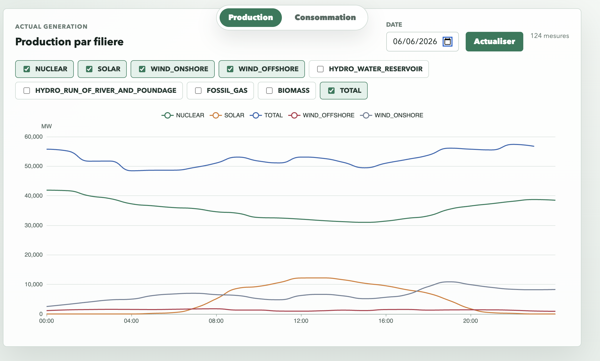

# EnergyScope

EnergyScope est un projet de visualisation de données consacré au système électrique français. Son objectif est de collecter, structurer et analyser des données énergétiques et météorologiques afin de proposer des tableaux de bord clairs, des comparaisons pertinentes et, à terme, des fonctionnalités simples de prévision.

Ce dépôt est actuellement en phase de cadrage et de conception. Il documente la vision du produit, l’architecture cible et la feuille de route des premières versions.

## Image d'avancement



## Objectifs

EnergyScope a pour ambition de :

- suivre la consommation électrique en France ;
- analyser la production par filière ;
- mettre en relation la production renouvelable et les conditions météorologiques ;
- comparer le comportement du système électrique selon les jours et les périodes ;
- introduire progressivement des fonctions de prévision et de suivi de la qualité des données.

## Périmètre

- **Zone couverte :** France
- **Granularité :** horaire
- **Sources de données principales :** RTE, ODRÉ, Open-Meteo

## Fonctionnalités prévues

Le produit s’articule autour de plusieurs modules de visualisation.

### 1. Dashboard national

Offrir une vision synthétique du système électrique français sur une journée ou une période donnée.

**Indicateurs principaux**

- consommation totale ;
- production totale ;
- production nucléaire ;
- production solaire ;
- production éolienne ;
- production hydraulique ;
- température moyenne ;
- pic de consommation et heure du pic.

**Visualisations envisagées**

- courbes de consommation par jour, semaine, mois et année ;
- aire empilée de la production par filière ;
- indicateurs clés de la journée ;
- synthèse régionale si les données sont disponibles.

### 2. Production solaire et météo

Analyser la relation entre la production solaire et les conditions météorologiques.

**Données exploitées**

- production solaire ;
- température ;
- couverture nuageuse ;
- rayonnement solaire ;
- heure ;
- saison.

**Visualisations envisagées**

- courbe de production solaire ;
- courbe de rayonnement solaire ;
- nuage de points rayonnement / production ;
- heatmap heure / jour.

### 3. Consommation et température

Étudier l’influence de la température sur la demande électrique.

**Fonctionnalités prévues**

- comparer consommation et température sur une même période ;
- détecter les pics liés au froid ou à la chaleur ;
- comparer les comportements hiver / été ;
- calculer des indicateurs de corrélation simples.

### 4. Mix électrique

Visualiser la part de chaque filière dans le mix électrique.

**Filières suivies**

- nucléaire ;
- solaire ;
- éolien ;
- hydraulique ;
- gaz ;
- charbon ;
- bioénergies ;
- import / export si disponible.

**Visualisations envisagées**

- aire empilée du mix électrique ;
- répartition journalière par filière ;
- histogrammes par source ;
- évolution hebdomadaire.

### 5. Comparaison de journées

Permettre de comparer deux dates distinctes et de mettre en évidence les écarts sur :

- la consommation ;
- la production solaire ;
- la température ;
- le mix électrique.

### 6. Prévision simple

Introduire des modèles d’estimation légers avant d’éventuelles approches de machine learning plus avancées.

**Premières approches envisagées**

- moyenne des jours similaires ;
- régression linéaire simple ;
- modèle basé sur la température, l’heure et le jour de la semaine.

**Évolutions possibles**

- Random Forest ;
- XGBoost ;
- Prophet ;
- SARIMA ;
- LightGBM.

### 7. Qualité des données

Suivre la fiabilité et la complétude des jeux de données ingérés.

**Indicateurs prévus**

- dernière ingestion réussie ;
- nombre de lignes récupérées ;
- nombre de lignes rejetées ;
- pourcentage de valeurs manquantes ;
- doublons détectés ;
- sources indisponibles ;
- périodes manquantes.

### 8. Monitoring des pipelines

Proposer une vue technique interne pour suivre l’exécution des traitements.

**Exemples d’informations suivies**

- statut des jobs ;
- durée d’exécution ;
- nombre de tentatives ;
- dernier message d’erreur.

## Architecture cible

L’architecture actuellement visée est la suivante :

```text
                ┌──────────────────────────┐
                │       Sources API         │
                │ RTE / ODRÉ / météo / ... │
                └─────────────┬────────────┘
                              │
                              ▼
                    ┌─────────────────┐
                    │ Ingestion Python │
                    │ httpx + Pydantic │
                    └────────┬────────┘
                             │
               ┌─────────────┴─────────────┐
               ▼                           ▼
      ┌─────────────────┐         ┌──────────────────┐
      │ Données brutes   │         │ Logs d’ingestion  │
      │ JSON / CSV       │         │ statuts, erreurs  │
      └────────┬────────┘         └──────────────────┘
               │
               ▼
       ┌──────────────────┐
       │ Transformation    │
       │ pandas            │
       └────────┬─────────┘
                │
        ┌───────┴────────┐
        ▼                ▼
┌──────────────┐  ┌────────────────┐
│ Parquet       │  │ PostgreSQL      │
│ analytique    │  │ application     │
└──────┬────────┘  └───────┬────────┘
       │                   │
       ▼                   ▼
┌──────────────┐   ┌────────────────┐
│ DuckDB        │   │ FastAPI         │
│ requêtes SQL  │   │ API backend     │
└──────────────┘   └───────┬────────┘
                           │
                           ▼
                  ┌────────────────┐
                  │ Vue.js          │
                  │ ECharts         │
                  └────────────────┘
```

## Orientation technique

La pile technique envisagée à ce stade est la suivante :

- **Ingestion :** Python, `httpx`, `pydantic`
- **Transformation des données :** `pandas`
- **Stockage analytique :** Parquet, DuckDB
- **Base applicative :** PostgreSQL
- **Backend :** FastAPI, SQLAlchemy, Alembic, Uvicorn
- **Frontend :** Vue.js, ECharts
- **Infrastructure :** Docker Compose
- **Fiabilité et qualité :** `pytest`, validation de données, planification des tâches, observabilité

## Feuille de route

### MVP

Le premier jalon se concentre sur :

- la consommation ;
- la production par filière ;
- l’intégration des données météo.

### Version 2

Le second jalon étendra le projet avec :

- la prévision simple ;
- les indicateurs de qualité des données ;
- la comparaison de journées.

## État du dépôt

Ce dépôt constitue aujourd’hui une base de travail pour le projet. Les prochaines étapes prévues sont :

1. définir la structure initiale du projet ;
2. implémenter les premiers pipelines d’ingestion ;
3. construire les premiers jeux de données analytiques ;
4. exposer une API backend ;
5. livrer les premières vues du dashboard.

## Licence

Aucune licence n’est définie pour le moment.
