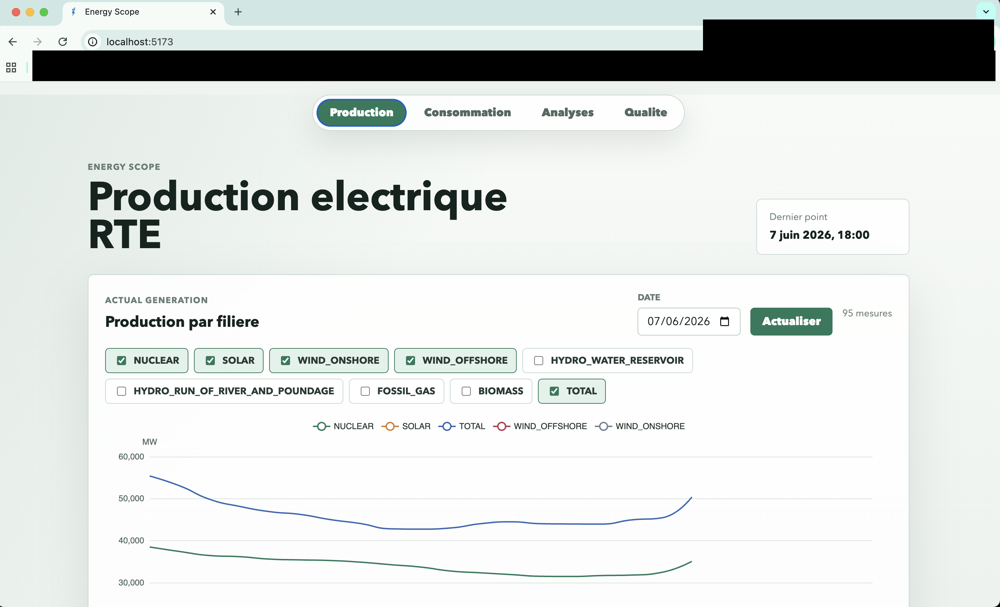
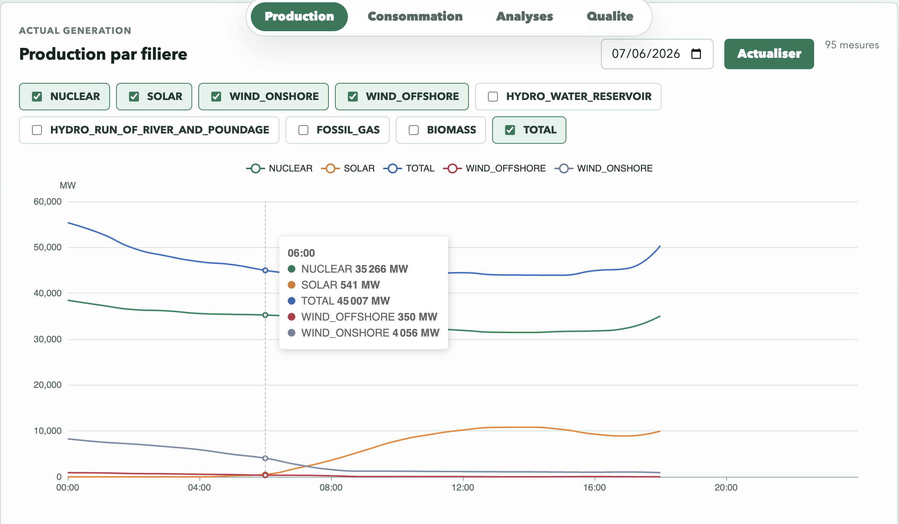
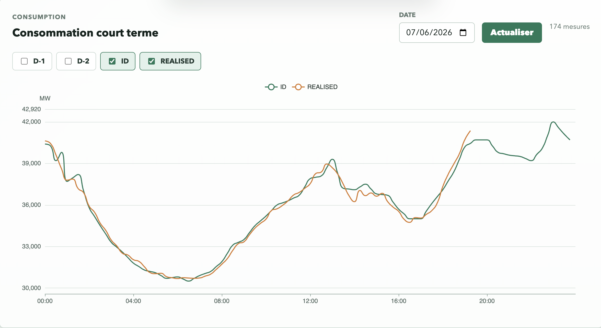
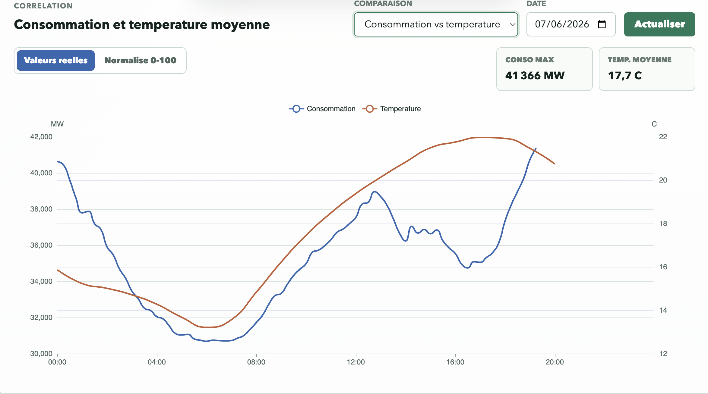
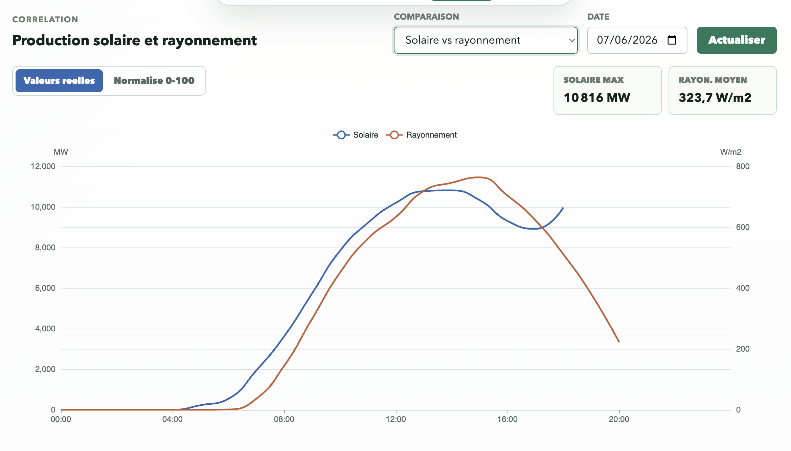
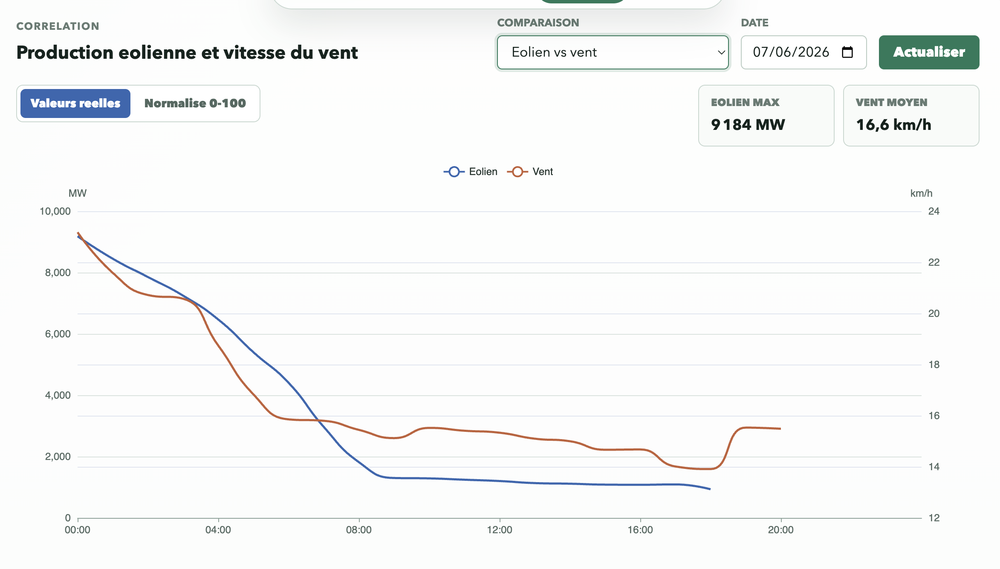
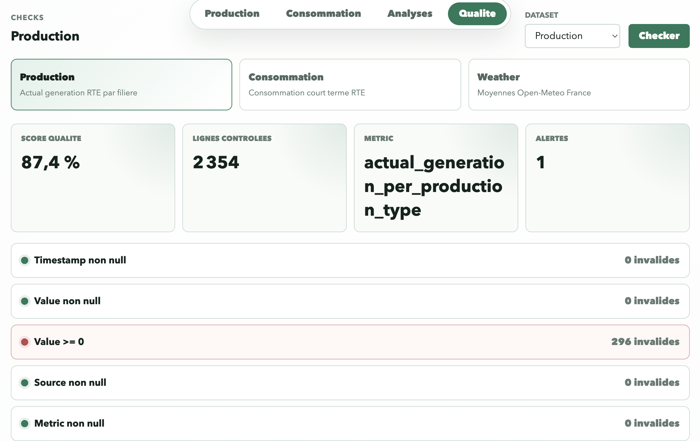
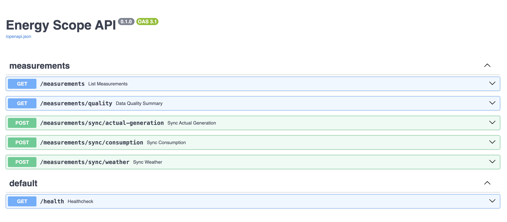

# EnergyScope

EnergyScope est une application de data engineering et de visualisation consacree au systeme electrique francais. Elle collecte des donnees RTE et Open-Meteo, les sauvegarde en brut, les transforme, les insere dans PostgreSQL, puis les expose dans une interface Vue.js.

L'objectif est de suivre la production, la consommation, la meteo, les correlations entre energie et conditions meteorologiques, ainsi que la qualite des donnees ingerees.

## Apercu



## Fonctionnalites

- Production electrique par filiere via RTE.
- Consommation electrique court terme via RTE.
- Donnees meteo horaires via Open-Meteo, moyennees sur plusieurs villes francaises.
- Comparaisons visuelles : consommation vs temperature, solaire vs rayonnement, eolien vs vent.
- Vue qualite des donnees : valeurs nulles, valeurs negatives, doublons.
- Backend FastAPI avec endpoints de lecture, synchronisation et controle qualite.
- Stockage PostgreSQL, raw JSON et Parquet.

## Architecture

```text
Sources API
  RTE / Open-Meteo
      |
      v
Ingestion Python
  clients httpx, retries, logs
      |
      +--> data/raw/<source>/<dataset>/...
      |
      v
Transforms pandas
  normalisation timestamps, unites, colonnes
      |
      +--> data/processed/<dataset>/... parquet
      |
      v
PostgreSQL
  table energy_measurements
      |
      v
FastAPI
  /health, /measurements, /measurements/sync, /measurements/quality
      |
      v
Frontend Vue + ECharts
  production, consommation, analyses, qualite
```

## Stack technique

- Backend : FastAPI, SQLAlchemy, Uvicorn.
- Ingestion : Python, httpx, pandas.
- Base applicative : PostgreSQL.
- Stockage fichiers : JSON brut et Parquet.
- Frontend : Vue.js, ECharts, Vite.
- Qualite et tests : pytest, controles pandas, endpoint qualite.
- Infrastructure : Docker Compose.

## Lancement Docker

Depuis un clone frais :

```bash
cd energy-scope
cp .env.example .env
docker compose up --build
```

Pour utiliser les synchronisations RTE, renseigner `RTE_BASIC_AUTH` dans `energy-scope/.env`. Sans cette variable, l'application demarre, mais les appels RTE production/consommation echoueront.

Services exposes :

- Frontend : http://localhost:5173
- Backend : http://localhost:8000
- Healthcheck : http://localhost:8000/health
- PostgreSQL : `localhost:5432`

La base PostgreSQL est initialisee automatiquement au demarrage du backend. Les donnees PostgreSQL sont conservees dans le volume Docker `postgres_data`.

Commandes utiles :

```bash
docker compose up --build
docker compose down
docker compose down -v
```

`docker compose down -v` supprime aussi le volume PostgreSQL local.

## Lancement local

Depuis `energy-scope/` :

```bash
cp .env.example .env
make backend-run
make frontend-run
```

Le backend local ecoute sur http://127.0.0.1:8000 et le frontend sur http://127.0.0.1:5173.

## Variables d'environnement

Le fichier `energy-scope/.env.example` documente les variables principales :

- `RTE_BASIC_AUTH` : credential RTE OAuth Basic.
- `DATABASE_URL` : URL PostgreSQL.
- `WEATHER_LOCATIONS` : villes utilisees pour approximer une moyenne France.
- `WEATHER_HOURLY_VARIABLES` : variables Open-Meteo recuperees.
- `LOG_LEVEL` et niveaux de logs techniques.

## Ingestion

Les jobs d'ingestion se trouvent dans `energy-scope/ingestion/energy_ingestion/jobs/`.

Ingestion meteo Open-Meteo :

```bash
cd energy-scope
python ingestion/energy_ingestion/jobs/ingest_weather.py --date 2026-06-06
```

Test client RTE et sauvegarde raw :

```bash
cd energy-scope
python ingestion/energy_ingestion/jobs/test_rte_raw.py
```

Chargement production RTE transformee vers PostgreSQL :

```bash
cd energy-scope
python ingestion/energy_ingestion/jobs/load_actual_generation_to_postgres.py
```

L'interface frontend peut aussi declencher des synchronisations via les endpoints `/measurements/sync/...`.

## API

Base URL locale : `http://localhost:8000`

### Healthcheck

```http
GET /health
```

Reponse :

```json
{"status": "ok"}
```

### Lire les mesures

```http
GET /measurements
```

Parametres principaux :

- `metric`
- `source`
- `zone`
- `measurement_type`
- `production_type`
- `start_date`
- `end_date`
- `limit`
- `offset`

Exemple :

```bash
curl "http://localhost:8000/measurements?metric=consumption_short_term&limit=10"
```

### Synchroniser une date

```http
POST /measurements/sync/actual-generation?date=2026-06-06
POST /measurements/sync/consumption?date=2026-06-06
POST /measurements/sync/weather?date=2026-06-06
```

Les dates futures sont refusees.

### Qualite des donnees

```http
GET /measurements/quality?dataset=production
GET /measurements/quality?dataset=consumption
GET /measurements/quality?dataset=weather
```

Regles controlees :

- `timestamp` non null
- `value` non null
- `value >= 0`
- `source` non null
- `metric` non null
- pas de doublons sur la cle naturelle

## Modele de donnees

La table applicative principale est `energy_measurements`.

Colonnes principales :

- `id` : identifiant technique.
- `timestamp` : debut de la mesure.
- `end_date` : fin de la mesure si fournie.
- `updated_date` : date de mise a jour source si fournie.
- `source` : `RTE`, `Open-Meteo`, etc.
- `metric` : famille de mesure, par exemple `consumption_short_term`, `actual_generation_per_production_type`, `weather_hourly`.
- `measurement_type` : type de mesure, par exemple `REALISED`, `temperature_2m`, `wind_speed_100m`.
- `production_type` : filiere de production, par exemple `NUCLEAR`, `SOLAR`, `WIND_ONSHORE`.
- `value` : valeur numerique.
- `unit` : unite, par exemple `MW`, `C`, `W/m2`, `km/h`.
- `zone` : zone geographique, aujourd'hui principalement `France`.
- `granularity` : granularite temporelle.
- `created_at` : date d'insertion.

Contrainte d'unicite :

```text
timestamp + source + metric + measurement_type + production_type + zone
```

Cette cle evite les doublons lors des insertions PostgreSQL.

## Structure du projet

```text
energy-scope/
  backend/       FastAPI, modeles SQLAlchemy, routes, services, repositories
  frontend/      Vue.js, vues, composants charts, client API
  ingestion/     clients API, transforms, loaders, jobs, checks qualite
  data/          raw JSON et processed Parquet locaux
  docs/          documentation source
  tests/         tests pytest
  docker-compose.yml
```

## Tests

Depuis `energy-scope/` :

```bash
./backend/.venv/bin/python -m pytest tests -q
npm --prefix frontend run build
```

## Captures d'ecrans

Capture deja presente :

- Vue production : 



- Vue Consommation : courbe de consommation



- Vue Analyses : comparaison `Consommation vs temperature`.



- Vue Analyses : comparaison `Solaire vs rayonnement`.



- Vue Analyses : comparaison `Eolien vs Vent`.



- Vue Qualite : controles qualite avec score et checks.



- Swagger FastAPI sur `http://localhost:8000/docs`.



